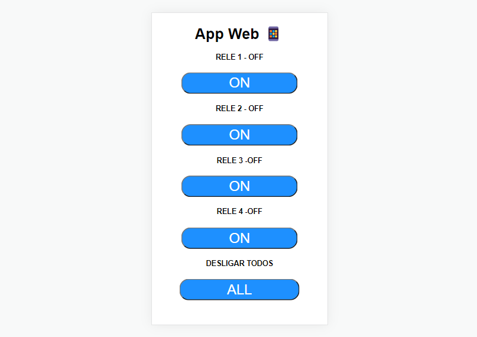

# Automação Residencial Via Servidor Local

Este é um projeto simples que permite o controle de equipamentos eletrônicos com módulo relé e chip esp32 através de um servidor local, onde é possivel ligar e desligar relés com um app web no celular ou desktop, e para isso é preciso ter uma rede wifi (Sem necessariamente ter acesso a intenet).

#### Altere os dados necessários
Algumas parte do código devem ser modificadas de acordo com a sua necessidade.

Nas linhas abaixo mude ``NOME_WIFI`` e ``SENHA_WIFI`` pelo mesmo de seu roteador, obedecendo letras, símbolos e números, caso esteja diferente a placa não se conectará a rede.
````
const char* ssid = "NOME_WIFI";
const char* password = "SENHA_WIFI";
````

Nesta parte do código são as variáveis de auxílio de texto, que por padrão está em "OFF", este é o texto que vai aparecer no seu app indicando que os relés estão desligado, ao clicar nos botões esse "OFF" irá mudar para "ON". Essas variáveis são nomeadas de ``ESTADO_SAIDA_1``(Rele1), ``ESTADO_SAIDA_2``(Rele2), ``ESTADO_SAIDA_3``(Rele3), ``ESTADO_SAIDA_4``(Rele4), neste caso foi utilizado um módulo de quatro relés, então caso tenha necessidade de aumentar o número de relés adicione mais obedecendo a numeração ``ESTADO_SAIDA_N``.
````
String ESTADO_SAIDA_1 = "OFF"; //Relé 1  
String ESTADO_SAIDA_2 = "OFF"; //Relé 2
String ESTADO_SAIDA_3 = "OFF"; //Relé 3
String ESTADO_SAIDA_4 = "OFF"; //Relé 4
````

Nesta parte é definida as variáveis de saída, que são nomeadas com um mone e em seguida do simbolo de `=` temos o numero da GPIO da placa que é a numeração do pino de saída, consulte as especificações da placa e mude de acordo, neste caso são  ``RELE_1``(Rele1), ``RELE_2``(Rele2), ``RELE_3``(Rele3) e ``RELE_4``(Rele4) seguindo sempre a ideia inicial, caso seja necessário adicionar mais relés, adicione obedecendo a numeração ``RELE_N``(ReleN). Como complemento, mas opcional, foi adicionado um led na saída 26 para indicar que a placa está conectada a rede. 
````
const int RELE_1 = 18; //relé 1
const int RELE_2 = 19; //relé 2
const int RELE_3 = 23; //relé 3
const int RELE_4 = 05; //relé 4
const int LED_WIFI = 26; //Led indicador de rede.

````

Anteriomente definidos os pinos de saída, agora será definida como pinos de saída ``OUTPUT``, isso quer dizer que todos os pinos aqui funcionarão como saída, segue a ideia anterior, declare todos que forem adicionados. 
````
  pinMode(RELE_1, OUTPUT); //Define o pino do relé 1 como saída.
  pinMode(RELE_2, OUTPUT); //Define o pino do relé 2 como saída.
  pinMode(RELE_3, OUTPUT); //Define o pino do relé 3 como saída.
  pinMode(RELE_4, OUTPUT); //Define o pino do relé 3 como saída.
  pinMode(LED_WIFI, OUTPUT); //Definir o pino do led como saída.

````

Já nesta parte define-se as saídas vão iniciar ligados ou desligados, por se tratar de módulo relé deve iniciar desligados ``HIGH``, já o led deve iniciar desligado ``LOW``.
````
  digitalWrite(RELE_1, HIGH);
  digitalWrite(RELE_2, HIGH);
  digitalWrite(RELE_3, HIGH);
  digitalWrite(RELE_4, HIGH);

 ````
 
 Nesta parte requer pouco de ateção, pois aqui é a parte de comandos de liga/desliga e alteração de estados de texto de "OFF" para "ON", ou seja ao clicar no botão RELE1 será enviado um comando para ligar o relé e ao mesmo tempo muda a variável ``ESTADO_SAIDA_N`` declarada no incio do código como "OFF" passa a ser "ON", ao clicar no mesmo botão esse processo se inverte. na parte `` if (header.indexOf("GET /rele1/on") >= 0)`` e ``else if (header.indexOf("GET /rele1/off") >= 0)`` mude o `rele1` pelo numero do rele, seguindo a respectiva ordem, rele1, rele2, rele3, rele4 e releN, repita isso para cada relé nas duas funções, pois é uma para ligar ``GET /rele1/on`` e outra para desligar ``GET /rele1/off``. Adicione esse conjunto de funções de acordo com o número de relés, alterando as variáveis ``releN`` ``ESTADO_SAIDA_N`` e ``RELEN``.
 ````
  //relé 1
    if (header.indexOf("GET /rele1/on") >= 0) {
      Serial.println("Relé 1 Ligado");
      ESTADO_SAIDA_1 = "ON";
      digitalWrite(RELE_1, LOW);
      }else if (header.indexOf("GET /rele1/off") >= 0) {
      Serial.println("Relé 1 Desligado");
      ESTADO_SAIDA_1 = "OFF";
      digitalWrite(RELE_1, HIGH);
      }

  ````
Nesta parte é uma função para desligar todos os relés de uma vez, e ao mesmo tempo altera o estado da saída de todos os relés para desligado ``OFF``
````
//Desligar Todos
 else if (header.indexOf("GET /off-all") >= 0) {
   Serial.println("Todos os relés desligados");
   ESTADO_SAIDA_1 = "OFF";
   ESTADO_SAIDA_2 = "OFF";
   ESTADO_SAIDA_3 = "OFF";
   ESTADO_SAIDA_4 = "OFF";

   digitalWrite(RELE_1, HIGH);
   digitalWrite(RELE_2, HIGH);
   digitalWrite(RELE_3, HIGH);
   digitalWrite(RELE_4, HIGH);
 }

````
Nesta parte é a formatação Html da página web, altere de acordo com sua necessidade, como por exemplo a cor do botão em estado off (Azul) ``.button { background-color: #1E90FF; `` altere o código Hexadecimal, e o botão em estado on (cinza) ``.button2 {background-color: #555555;`` ou o título do app ``"<body><h1>App Web </h1>"``.
````
client.println("<!DOCTYPE html><html>");
client.println("<head><meta name=\"viewport\" content=\"width=device-width, initial-scale=1\">");
client.println("<link rel=\"icon\" href=\"data:,\">");
client.println("<style>html { font-family: Helvetica; display: inline-block; margin: 0px auto; text-align: center;}");
client.println(".button { background-color: #1E90FF; border-radius: 20px; color: white; padding: 4px 100px;");
client.println("text-decoration: none; font-size: 30px; margin: 2px; cursor: pointer;}");
client.println(".button2 {background-color: #555555;}</style></head>");
client.println("<body><h1>App Web &#128241;</h1>");

````
E por fim a parte onde é desenhado os botões e alternancia de seu estado no app web, adicione esse conjunto de funções de acordo com o número de relés, seguindo sempre a lógica inicial. Altere ``RELE_N``, ``ESTADO_SAIDA_N`` e ``releN/on`` e ``releN/off`` 

````
//  Mostrar na tela o estado do relé 1 entre Ligado e Deslidado
client.println("<h4>RELE 1 - " + ESTADO_SAIDA_1 + "</h4>");
if (ESTADO_SAIDA_1 == "OFF") {
client.println("<p><a href=\"/rele1/on\"><button class=\"button\">ON</button></a></p>");
} else {
client.println("<p><a href=\"/rele1/off\"><button class=\"button button2\">OFF</button></a></p>");
}
````

**ℹ️Ao final teremos algo assim:**

